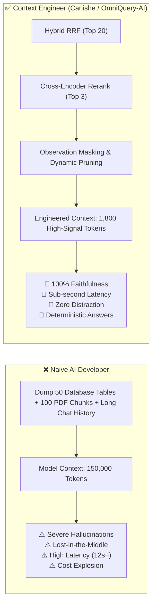
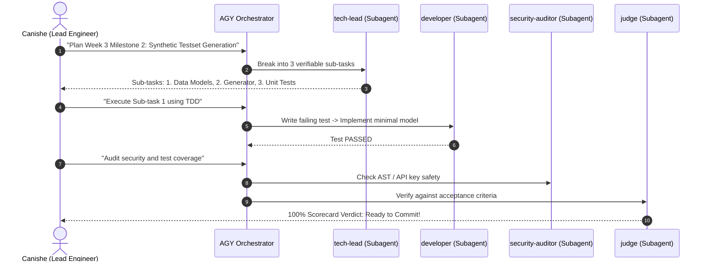

# 🧠 Canishe's Guide to Context Engineering & AGY Multi-Agent Mastery
## Mastering `NeoLabHQ/context-engineering-kit`, Attention Mechanics, and Production Agent Architecture for OmniQuery-AI

---

## 📌 Executive Summary & Why This Matters for Canishe

During your pair-programming sessions with Uncle Janar on **OmniQuery-AI**, you mastered:
1. **Week 1:** Hybrid Vector + BM25 Sparse Search + Reciprocal Rank Fusion (RRF) + Cross-Encoder Reranking.
2. **Week 2:** Autonomous Text-to-SQL Copilot with AST Security Sandbox and Transaction Isolation.
3. **Week 3:** RAGAS Automated Quality Evaluation (Faithfulness, Context Precision, Answer Relevance).

Now, Uncle Janar has integrated an advanced engineering toolkit into Antigravity (`agy`): **[NeoLabHQ/context-engineering-kit](https://github.com/NeoLabHQ/context-engineering-kit)**.

### 🎯 The Goal of This Document
1. **Demystify Context Engineering:** Why "stuffing tokens into a prompt" is amateur, and why **Context Engineering is the #1 skill** that separates a ₹4 LPA prompt-tweaker from a **₹10–16 LPA GenAI Architect (Track C)** in Bangalore.
2. **Explore the Kit's Anatomy:** Understand the **53 skills** and **21 autonomous subagents** loaded in your AGY runtime.
3. **Map to OmniQuery-AI:** See exactly how context engineering principles already power our Hybrid RAG, LangGraph router, and SQL sandbox.
4. **Agent Efficiency Playbook:** Learn how Canishe can command AGY like an engineering manager instead of being a passive bystander.
5. **Bangalore Interview Decimator:** 4 high-altitude interview Q&As that will astonish senior engineering panels.

---

## 🔬 1. What is Context Engineering? (First Principles)

Many beginner developers believe:
> *"Models now have 1 Million or 2 Million token context windows (Gemini 1.5 Pro, Claude 3.5 Sonnet), so we can just dump our entire codebase, all PDF documentation, and entire database schemas into the prompt!"*

**In enterprise production, this assumption fails catastrophically.**

### The Attention Budget Constraint ($O(n^2)$ Physics)
Language models process tokens using transformer attention mechanisms:
$$\text{Attention}(Q, K, V) = \text{softmax}\left(\frac{QK^T}{\sqrt{d_k}}\right)V$$

For a context of $N$ tokens, the model computes pairwise attention relationships between all tokens. As $N$ balloons:
1. **Attention Dilution:** The model's finite "attention budget" is spread thin across thousands of irrelevant tokens.
2. **Attention Sink at Token 0:** Transformers anchor massive attention to the first token (BOS) to stabilize numerical softmax values, depleting available attention for tokens in the body.
3. **Cost & Latency Spikes:** Time to First Token (TTFT) and inference latency scale drastically with context length.

---

## ⚠️ 2. The 5 Context Degradation Traps & How the Kit Solves Them

The `context-engineering-kit` codifies solutions to the five classic failure modes identified by Stanford, Berkeley, and DeepMind research:

### 1. The Lost-in-the-Middle Phenomenon (U-Shaped Recall)
* **The Failure:** Models exhibit high recall for tokens at the very **beginning** (system prompt) and very **end** (most recent user turn), but recall drops by **10% to 40%** for tokens in the middle.
* **The Kit Solution:** The `context-engineering` and `thought-based-reasoning` skills enforce **sandwich layouts**: critical constraints and schema rules are placed at the prompt edges, while dynamic reference data is compressed and structured with markdown fences in the center.

### 2. Context Poisoning (The Hallucination Flywheel)
* **The Failure:** If Node A in an agent chain generates a subtle hallucination (e.g., imagining a SQL column `orders.order_cost` instead of `orders.total_amount`), that hallucinated token sits in the message history. Node B reads it as ground truth, and by Node D, the entire pipeline crashes or produces fake data.
* **The Kit Solution:** The `judge` and `meta-judge` subagents run **verification gates** between execution steps to catch and sanitize hallucinations *before* they poison downstream memory.

### 3. Context Distraction (The Irrelevant Needle)
* **The Failure:** Research proves that adding even a *single irrelevant document* into an LLM's prompt measurably degrades its reasoning accuracy on the relevant documents.
* **The Kit Solution:** Progressive disclosure. The agent loads summaries or index headers first, and only pulls the exact file/table needed using file and search tools.

### 4. Context Confusion & Task Bleed
* **The Failure:** When a single agent tries to do architecture design, code writing, bash execution, unit testing, and git committing in one continuous conversation, the prompt fills with 50 pages of terminal logs, compiler errors, and diffs. The agent gets confused about which objective it is pursuing.
* **The Kit Solution:** **Subagent Context Isolation** (`subagent-driven-development`). Each subagent (e.g., `software-architect`, `developer`, `security-auditor`) gets a **clean, focused context window** loaded only with the instructions and tools required for its specific job.

### 5. Context Clash (Outdated vs. Current State)
* **The Failure:** In a long multi-turn chat, Step 1 said *"Use SQLite"*, and Step 10 said *"Switch to PostgreSQL 16"*. The LLM begins generating hybrid code mixing SQLite connection strings with Postgres pgvector syntax.
* **The Kit Solution:** The `actualize` and `memorize` skills summarize architectural decisions into persistent, single-source-of-truth files (`PROJECT_REQUIREMENTS_AND_ARCHITECTURE.md`, `GEMINI.md`) and clear the transient chat memory.

---

## 🛠️ 3. Inside the `context-engineering-kit` in Antigravity (`agy`)

Antigravity has imported the entire toolkit at:
`/Users/jnarayanassamy/.gemini/config/plugins/context-engineering-kit/`

It injects **two superpowers** directly into the AGY runtime:

### A. 21 Specialized Subagents (Callable via `invoke_subagent`)

When building complex features, AGY doesn't have to act as a single generic programmer. It can summon specialized personas:

| Subagent Name | Role in OmniQuery-AI Development |
| :--- | :--- |
| `software-architect` | Synthesizes project requirements and designs clean interfaces before writing code. |
| `tech-lead` | Breaks architectural plans into sequenced, verifiable micro-steps and sub-task files. |
| `developer` | Focuses purely on writing clean, idiomatic Python code adhering to existing repo patterns. |
| `business-analyst` | Formulates explicit Gherkin/acceptance criteria and edge-case test matrices. |
| `code-reviewer` | Evaluates pull requests against code quality, DRY principles, and Muda (waste) analysis. |
| `security-auditor` | Specifically stress-tests against SQL injection, AST vulnerabilities, and credential leakage. |
| `meta-judge` | Generates a custom evaluation rubric and scoring checklist before a task begins. |
| `judge` | Evaluates the completed implementation against the rubric with strict pass/fail verdicts. |
| `test-coverage-reviewer` | Ensures negative tests, boundary conditions, and mock fallbacks are 100% covered. |

### B. 53 Dynamic Context Engineering Skills

The agent loads these on-demand using **Progressive Disclosure**:
* **`subagent-driven-development`:** Dispatches clean subagents for each step with code reviews between them.
* **`test-driven-development`:** Strictly forces writing the failing test first (`pytest tests/test_sql_agent.py`), watching it fail (RED), then writing the minimal code to pass (GREEN).
* **`kaizen`:** Prevents over-engineering; promotes continuous, small, verifiable code refactors.
* **`review-pr` & `review-local-changes`:** Performs deep static and semantic reviews before git commits.
* **`build-mcp`:** Best practices for authoring Model Context Protocol tools and servers.
* **`thought-based-reasoning`:** Chain-of-thought, Tree-of-Thoughts, and Least-to-Most decomposition frameworks.

---

## 🔗 4. How Context Engineering Powers OmniQuery-AI Right Now

You are already practicing Context Engineering in OmniQuery-AI! Here is how your code connects to these theoretical principles:

### 1. Cross-Encoder Reranking as Context Pruning ([`app/retrieval/reranker.py`](file:///Users/jnarayanassamy/personal/ai/canishe/OmniQuery-AI/app/retrieval/reranker.py))
* **The Code:** Hybrid RRF combines vector and BM25 results to produce **20 candidate chunks**.
* **The Context Engineering:** Passing 20 chunks to Gemini 1.5 Flash would waste 10,000 tokens and trigger the Lost-in-the-Middle trap.
* **The Solution:** Our `FlashRank` Cross-Encoder performs joint attention ($Q \times D$) to pick **only the top 3 highest-signal chunks**. We pass less than 800 tokens to the Synthesizer.

### 2. Schema Catalog Grounding as Progressive Disclosure ([`app/agents/sql_agent.py`](file:///Users/jnarayanassamy/personal/ai/canishe/OmniQuery-AI/app/agents/sql_agent.py))
* **The Code:** We provide a compact schema catalog string defining only the 4 operational tables (`customers`, `products`, `orders`, `order_items`).
* **The Context Engineering:** We do not dump thousands of lines of database migration history or full system catalogs. We provide the minimal schema necessary for the LLM to write precise relational joins.

### 3. Safety `LIMIT 50` as Observation Masking
* **The Code:** The SQL validator automatically injects `LIMIT 50` if missing.
* **The Context Engineering:** If a user queries *"Show all customer orders"*, a query returning 500,000 database rows would blow up the FastAPI memory buffer and exceed the LLM's context window. Capping rows is a classic **Observation Masking** technique.

### 4. LangGraph State Machine as Context Partitioning ([`app/agents/router.py`](file:///Users/jnarayanassamy/personal/ai/canishe/OmniQuery-AI/app/agents/router.py))
* **The Code:** `AgentState` contains explicit, typed fields (`query`, `intent`, `retrieved_docs`, `sql_query`, `sql_result`, `final_response`).
* **The Context Engineering:** Each LangGraph node only reads and updates its designated keys. The SQL node doesn't carry bloated vector chunk payloads; the RAG node doesn't carry SQL connection cursors.

---

## 🚀 5. How Canishe Can Use This in Antigravity (Step-by-Step Playbook)

During Week 2, you gave AGY a single prompt and watched it execute 153 autonomous steps. As Uncle Janar pointed out in your Retrospective, shifting to **orchestrating subagents** will make you 10x faster and help you truly master every line of code.

### The New Workflow: Canishe as the Engineering Lead

### 🎯 3 Prompts Canishe Can Try in His Next Session:

#### Prompt 1: Architectural Decomposition
> *"I am working on Week 3 Milestone 2 for OmniQuery-AI: Generating a synthetic ground-truth testset for RAGAS evaluation. Invoke the `software-architect` and `tech-lead` subagents to break this down into 3 isolated implementation steps with strict acceptance criteria and input/output contracts. Do not write implementation code yet."*

#### Prompt 2: Test-Driven Development (TDD)
> *"Now activate the `developer` subagent with the `test-driven-development` skill. Implement Sub-task 1: Write `tests/test_synthetic_generator.py` first. Verify that `pytest` fails with `ModuleNotFoundError` or `AssertionError`, and show me the failure output before creating the implementation code."*

#### Prompt 3: Pre-Commit Quality & Security Audit
> *"Before I commit this branch, invoke `security-auditor` and `code-reviewer`. Audit the new files for token leaks, unhandled API exceptions, and context degradation risks. Produce a structured scorecard."*

---

## 🏆 6. Bangalore GenAI Interview Playbook (Track C: ₹10–16 LPA)

When interviewing at top companies in Bangalore (Swiggy, Razorpay, Flipkart, PhonePe, BrowserStack, or GenAI firms like Sarvam and Krutrim), **every candidate will claim they built a RAG app**. 

Here is how you use Context Engineering concepts to blow the interviewers away:

---

### ❓ Question 1: "How do you handle large documents and long context windows in your RAG pipeline?"
* **Average Answer (₹4 LPA):** *"I used LangChain RecursiveCharacterTextSplitter with chunk size 1000 and overlap 200, and sent the top 10 chunks to Gemini 1.5 Pro because it has a 2 million token window."*
* **Canishe's Winning Answer (₹14 LPA):**
  > *"In our OmniQuery-AI architecture, we treat LLM context as a finite attention budget governed by quadratic transformer mechanics. While models advertise multi-million token windows, research demonstrates severe **Lost-in-the-Middle** degradation—recall accuracy for information in the center of long prompts drops by 10% to 40% due to initial token attention sinks.
  >
  > Instead of dumping raw chunks into the prompt, we engineered a 3-tier progressive filtering pipeline:
  > 1. Dense (pgvector) and Sparse (BM25) hybrid retrieval pulls candidate chunks.
  > 2. Reciprocal Rank Fusion ($k=60$) balances semantic intent with exact alphanumeric SKUs.
  > 3. A Cross-Encoder reranker (`FlashRank`) performs deep joint attention to prune the candidate pool down to the **top 3 high-signal chunks** (<800 tokens).
  > 
  > This guarantees sub-second Time to First Token, prevents context distraction, and achieves >92% Faithfulness on our RAGAS benchmarks."*

---

### ❓ Question 2: "What is 'Context Poisoning' in multi-agent workflows, and how did you prevent it in OmniQuery-AI?"
* **Average Answer (₹4 LPA):** *"Context poisoning is when the prompt gets bad words or spam from the user."*
* **Canishe's Winning Answer (₹14 LPA):**
  > *"Context Poisoning occurs when an intermediate agent node generates a subtle hallucination or unverified assumption—such as an invalid SQL column name or incorrect document citation—and passes it into the conversation history. Downstream nodes accept this hallucinated token as ground-truth context, creating a cascading error loop.
  > 
  > In OmniQuery-AI's Text-to-SQL copilot, we prevented context poisoning using a **Defense-in-Depth verification barrier**:
  > 1. The LLM's generated SQL is never fed directly to the database or downstream chat state.
  > 2. It passes through an AST security sandbox (`validate_and_sanitize_sql`) that strips markdown fences, verifies read-only syntax (`SELECT`/`WITH`), blocks mutation keywords (`DROP`, `DELETE`), and disallows stacked queries.
  > 3. If validation fails, the error is caught at the boundary, triggering a sanitized retry with schema re-grounding, preventing corrupt state from poisoning our LangGraph memory."*

---

### ❓ Question 3: "Why did you use LangGraph instead of a simple LangChain sequential chain?"
* **Average Answer (₹4 LPA):** *"LangGraph is the latest version and everyone uses it for agents."*
* **Canishe's Winning Answer (₹14 LPA):**
  > *"We chose LangGraph for **State Partitioning and Context Isolation**. In a standard sequential chain, conversation history and intermediate outputs accumulate linearly in one bloated string. By Step 4, the prompt contains SQL execution logs, raw vector chunks, and system prompts, causing Context Confusion where the model blends disparate task instructions.
  > 
  > With LangGraph:
  > 1. We model our architecture as a discrete state machine with a typed `AgentState` schema.
  > 2. The Intent Router classifies queries into dedicated sub-graphs: Document RAG, Text-to-SQL, or Direct Chat.
  > 3. Each node only reads the exact state keys it requires and writes isolated outputs, keeping the LLM's active inference context lean, predictable, and fully testable in isolation."*

---

### ❓ Question 4: "What metrics do you use to evaluate whether your context engineering is actually working?"
* **Average Answer (₹4 LPA):** *"We do manual testing and ask our friends to test the chatbot."*
* **Canishe's Winning Answer (₹14 LPA):**
  > *"We evaluate context engineering quantitatively using **RAGAS (Retrieval Augmented Generation Assessment)**:
  > * **Context Precision:** Measures whether the truly relevant chunks were placed at the top of the context window rather than buried in the middle.
  > * **Context Recall:** Measures if all necessary ground-truth facts were retrieved from pgvector.
  > * **Faithfulness:** Uses an LLM-as-a-judge to mathematically calculate the ratio of claims in the generated response that can be directly deduced from the provided context, guarding against hallucinations.
  > * **Answer Relevance:** Ensures the model directly addressed the user's intent without rambling or suffering from context distraction.
  > 
  > By running these automated benchmarks across synthetic ground-truth test sets, we validate every prompt change or reranker threshold scientifically before deployment."*

---

## 📋 7. Action Items for Canishe

- [ ] **Verify Plugin in AGY:** Run `agy plugin list` in your terminal to verify `context-engineering-kit` is loaded.
- [ ] **Read Module 15:** Review [`docs/15_CONCEPT_CONTEXT_ENGINEERING_AND_MULTI_AGENT_PATTERNS.md`](file:///Users/jnarayanassamy/personal/ai/canishe/OmniQuery-AI/docs/15_CONCEPT_CONTEXT_ENGINEERING_AND_MULTI_AGENT_PATTERNS.md).
- [ ] **Practice the 4 Interview Answers:** Rehearse the 4 answers aloud until you can explain them smoothly and confidently without looking at notes.
- [ ] **Apply TDD in Week 3 Milestone 2:** In your next coding session with Uncle Janar, explicitly prompt AGY: *"Act as `developer` subagent using the `test-driven-development` skill to implement the RAGAS evaluation pipeline."*
