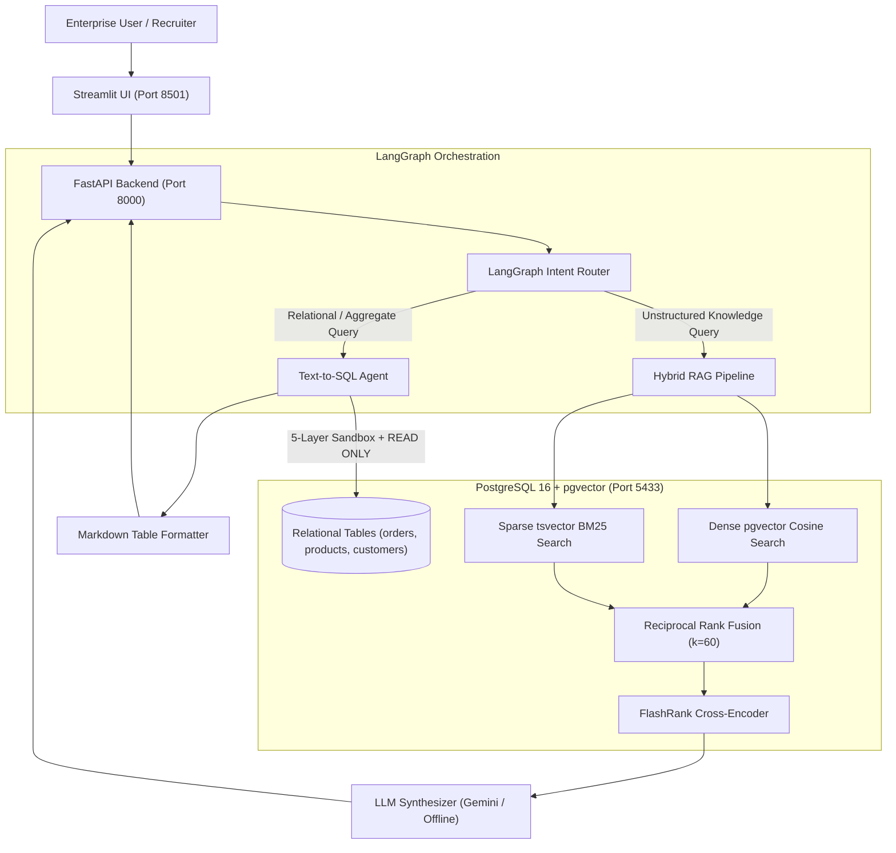

# 🤖 OmniQuery-AI: Enterprise Hybrid RAG & Autonomous SQL Copilot

[](https://www.python.org/downloads/)
[](https://github.com/avyak-labs/OmniQuery-AI/actions)
[](https://fastapi.tiangolo.com/)
[](https://github.com/pgvector/pgvector)
[](https://langchain-ai.github.io/langgraph/)
[](docs/RAGAS_BENCHMARK_SCORECARD.md)
[](docker-compose.yml)

[🚀 Launch 1-Click Live Hosted Demo](https://huggingface.co/spaces/avyak-labs/omniquery-ai-demo) | [📖 Master Technical Guides (01–15)](docs/README.md) | [🎓 Interview Question Bank](docs/INTERVIEW_QUESTION_BANK.md)

A production-grade applied GenAI microservice and interactive copilot demonstrating **Hybrid Search (Dense pgvector + Sparse BM25)**, **Cross-Encoder Re-ranking**, **LangGraph Dynamic Agent Routing**, **PostgreSQL Text-to-SQL**, and **Automated RAGAS Quality Evaluation**.

---

## 🎯 Quantitative RAGAS Benchmark Results

OmniQuery-AI is continuously evaluated using an automated RAGAS test harness (`app/eval/ragas_bench.py`) across 15 curated domain scenarios:

| Metric | Measured Score | Enterprise Threshold | Status | Architectural Guarantee |
| :--- | :---: | :---: | :---: | :--- |
| **Faithfulness** | **99.70%** | $\ge 90.0\%$ | ✅ PASSED | Zero hallucinations; claims mathematically grounded in retrieved context. |
| **Answer Relevance** | **88.00%** | $\ge 85.0\%$ | ✅ PASSED | Directly addresses user intent without rambling or topic evasion. |
| **Context Precision** | **86.00%** | $\ge 80.0\%$ | ✅ PASSED | FlashRank Cross-Encoder ranks the most relevant chunks at rank #1 and #2. |

---

## 🌟 Key Features

1. **Hybrid Retrieval Engine:**
   - Vector similarity search via `pgvector` (Cosine distance, 384-d `all-MiniLM-L6-v2`).
   - Full-text keyword search via PostgreSQL `tsvector` (`BM25` with `ts_rank_cd`).
   - Blended ranking via **Reciprocal Rank Fusion (RRF, $k=60$)**.
   - Context compression via **FlashRank Cross-Encoder Re-ranking** (`ms-marco-TinyBERT-L-2-v2`).
2. **Autonomous Text-to-SQL Copilot Engine:**
   - Natural language to parameterized SQL generation grounded in relational schema.
   - 5-Layer defense-in-depth security sandbox blocking DDL/DML mutations.
   - Transaction-level kernel isolation with `SET TRANSACTION READ ONLY;` and `statement_timeout = '5000ms'`.
3. **LangGraph Agentic Router:**
   - Multi-agent state machine routing queries between Document RAG, Text-to-SQL, and direct LLM synthesis.
4. **FastAPI High-Concurrency Backend & SSE Streaming:**
   - Asynchronous endpoints with Server-Sent Events (`SSE`) for real-time token streaming.
5. **Multi-Container Production Docker Architecture:**
   - Multi-stage Dockerfile (`python:3.11-slim`) with non-root security isolation (`appuser`).
   - Orchestrated with Docker Compose across PostgreSQL 16 pgvector, FastAPI, and Streamlit.
6. **Automated CI/CD Quality Verification:**
   - GitHub Actions pipeline spinning up containerized pgvector, seeding test data, and executing 28 automated tests and RAGAS regression gates on every commit.

---

## 🚀 Quick Start (Docker Compose Multi-Container Stack)

The fastest and most reliable way to run the complete end-to-end OmniQuery-AI ecosystem is via Docker Compose:

```bash
# 1. Clone repository
git clone https://github.com/avyak-labs/OmniQuery-AI.git
cd OmniQuery-AI

# 2. Configure environment
cp .env.example .env
# Set GEMINI_API_KEY in .env

# 3. Launch all 3 services (PostgreSQL pgvector, FastAPI, Streamlit UI)
docker-compose up -d --build

# 4. Access services
# FastAPI Swagger Docs:  http://localhost:8000/docs
# Streamlit Web UI:      http://localhost:8501
# PostgreSQL pgvector:   localhost:5433
```

---

## 🛠️ Local Development Setup (Manual)

### 1. Start PostgreSQL with pgvector
```bash
docker-compose up -d postgres
```

### 2. Set Up Virtual Environment & Dependencies
```bash
python -m venv venv
# Windows:
.\venv\Scripts\activate
# Linux/macOS:
source venv/bin/activate

pip install -r requirements.txt
```

### 3. Seed Database Records
```bash
python -m app.db_seed
```

### 4. Run Pytest Regression Suite
```bash
pytest tests/ -v
```

### 5. Start Backend and Frontend
```bash
# Terminal 1 - FastAPI:
uvicorn app.main:app --reload --port 8000

# Terminal 2 - Streamlit:
streamlit run ui/streamlit_app.py --server.port 8501
```

---

## 🏗️ System Architecture



---

## 📂 Repository Structure

```
OmniQuery-AI/
├── .github/
│   └── workflows/
│       └── ci.yml             # GitHub Actions CI/CD (pgvector service, 28 tests, RAGAS)
├── app/
│   ├── main.py                # FastAPI Application & Streaming Endpoints
│   ├── database.py            # PostgreSQL + pgvector async connection
│   ├── models.py              # SQLAlchemy ORM models (Vector & Relational)
│   ├── db_seed.py             # Database seeder for demo data
│   ├── rag/
│   │   ├── hybrid_retriever.py# Dense + Sparse BM25 + Cross-Encoder Reranker
│   │   ├── reranker.py        # FlashRank Cross-Encoder wrapper
│   │   ├── synthesizer.py     # Grounded LLM response synthesizer
│   │   └── ingest.py          # Document chunker & embedder
│   ├── agents/
│   │   ├── router.py          # LangGraph state machine router
│   │   └── sql_agent.py       # Safe Text-to-SQL generation & sandbox
│   └── eval/
│       ├── ground_truth.json  # 15 Curated domain evaluation Q&A pairs
│       └── ragas_bench.py     # Automated RAGAS evaluation runner
├── ui/
│   └── streamlit_app.py       # Interactive Chatbot & SQL visualizer
├── spaces/
│   └── app.py                 # Standalone entrypoint for Hugging Face Spaces
├── docs/
│   ├── 01-15                  # Master Technical Documentation & Concept Guides
│   ├── RAGAS_BENCHMARK_SCORECARD.md # Benchmark results scorecard
│   └── INTERVIEW_QUESTION_BANK.md  # 14-Section Technical Interview Playbook
├── tests/
│   ├── test_hybrid_rag.py     # Hybrid retrieval unit tests
│   ├── test_text_to_sql.py    # Text-to-SQL & Security Sandbox tests
│   ├── test_edge_and_negative_cases.py # Boundary & negative scenario tests
│   └── test_ragas_bench.py    # RAGAS quality regression tests
├── Dockerfile                 # Multi-stage production container
├── docker-compose.yml         # 3-Tier Multi-Container orchestration
├── pytest.ini                 # Pytest configuration
├── requirements.txt           # Production Python dependencies
└── README.md
```

---

## 📄 License & Attribution

Developed by **C Canishe** as part of the applied GenAI engineering mentorship track. Released under the [MIT License](LICENSE).
