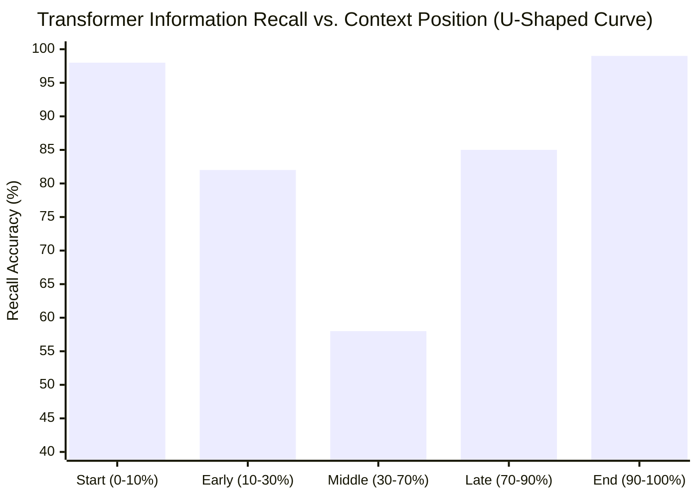
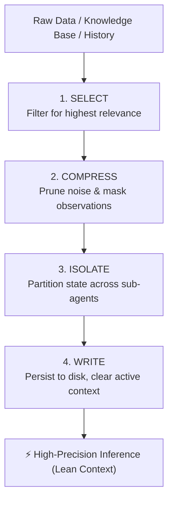

# 15. Concept: Context Engineering, Attention Budgets & Multi-Agent Isolation Patterns

**Module:** `15_CONCEPT_CONTEXT_ENGINEERING_AND_MULTI_AGENT_PATTERNS.md`  
**System Location:** [`app/rag/reranker.py`](file:///Users/janar/personal/kids/canishe_rahul/OmniQuery-AI/app/rag/reranker.py), [`app/agents/router.py`](file:///Users/janar/personal/kids/canishe_rahul/OmniQuery-AI/app/agents/router.py), [`app/agents/sql_agent.py`](file:///Users/janar/personal/kids/canishe_rahul/OmniQuery-AI/app/agents/sql_agent.py)  
**Target Roles:** Senior GenAI Engineer, LLM Application Architect (Track C: ₹10–16 LPA)  

---

## 🧭 Executive Summary

As language model context windows expanded from 4K tokens (GPT-3.5) to 128K (GPT-4o) and 2M tokens (Gemini 1.5 Pro), industry developers made a dangerous assumption: **"We no longer need to prune or manage context—we can dump everything into the prompt."**

In production enterprise systems, this leads to **Context Degradation**:
1. **Lost-in-the-Middle:** Recall degrades by 10% to 40% for facts placed in the center of long contexts.
2. **Context Poisoning:** Hallucinations or unvalidated tool responses cascade into downstream agent state.
3. **Context Distraction:** Irrelevant retrieved chunks dilute the model's self-attention budget, dropping answer precision.
4. **Latency & Cost Spikes:** Time to First Token (TTFT) scales quadratically with raw token volume.

This curriculum module details the core tenets of **Context Engineering** and **Multi-Agent Context Isolation**, showing how OmniQuery-AI solves these problems using Hybrid RRF, Cross-Encoder reranking, AST validation barriers, and LangGraph discrete state isolation.

---

## 📐 1. The Physics of Attention: Why Context Is a Finite Resource

Language models rely on scaled dot-product self-attention:
$$\text{Attention}(Q, K, V) = \text{softmax}\left(\frac{QK^T}{\sqrt{d_k}}\right)V$$

For sequence length $N$, the attention matrix requires computing $N \times N$ token affinities:

```
[Token 1] <---> [Token 2] <---> [Token 3] ... <---> [Token N]
```

### The Attention Sink Phenomenon
Transformer models allocate an overwhelming portion of attention weights to the initial token (often the `[BOS]` token or system header) regardless of semantic importance, acting as a numerical "sink" to preserve softmax stability.

As context length $N$ increases:
* The remaining attention budget is divided across more tokens.
* Tokens in the **middle 60%** of the context receive the weakest gradients and attention weights.
* Information placed at the **edges** (beginning and end) is recalled with high accuracy (the U-shaped curve).



---

## 🛡️ 2. The Four Pillars of Context Engineering

To prevent degradation, production systems apply four fundamental operations:



### Pillar 1: Select (Progressive Disclosure)
Do not pre-load all instructions, documentation, and database schemas. Load minimal index references first, and retrieve full text just-in-time only when triggered.

### Pillar 2: Compress (Observation Masking)
When agents call tools or query databases, tool outputs often span thousands of lines (e.g., raw SQL output with 1,000 rows, or entire HTML pages). Replace verbose payloads with compact summaries or top-$k$ previews (`LIMIT 50`) before feeding them back into the LLM.

### Pillar 3: Isolate (Sub-Agent Context Partitioning)
Instead of a monolithic multi-turn chat where planning, coding, database execution, and security auditing happen in one prompt, divide responsibilities across specialized subagents (`developer`, `security-auditor`, `judge`). Each subagent operates within an isolated, pristine context window.

### Pillar 4: Write (External Memory Scratchpads)
Store long-term state, architectural decisions, and intermediate outputs outside the LLM window (in PostgreSQL, SQLite, or markdown files on disk). Summarize decisions into single-source-of-truth files and discard conversational scaffolding.

---

## 🏗️ 3. How OmniQuery-AI Implements Context Engineering

| Architecture Component | OmniQuery-AI Module | Naive Implementation | OmniQuery-AI Context Engineered Implementation |
| :--- | :--- | :--- | :--- |
| **Document Retrieval** | [`app/rag/reranker.py`](file:///Users/janar/personal/kids/canishe_rahul/OmniQuery-AI/app/rag/reranker.py) | Dump 20 vector search chunks into the LLM prompt (8,000+ tokens). | Hybrid RRF + `FlashRank` Cross-Encoder joint attention cuts candidate pool to **top 3 high-signal chunks** (<800 tokens). Eliminates Lost-in-the-Middle. |
| **Database Schema** | [`app/agents/sql_agent.py`](file:///Users/janar/personal/kids/canishe_rahul/OmniQuery-AI/app/agents/sql_agent.py) | Dump entire Postgres schema DDL, system tables, and migration history (15,000+ tokens). | Curated, high-signal schema catalog with explicit Foreign Key mappings for 4 business tables. Zero hallucinated table names. |
| **Query Output Safety** | [`app/agents/sql_agent.py`](file:///Users/janar/personal/kids/canishe_rahul/OmniQuery-AI/app/agents/sql_agent.py) | Allow unbounded `SELECT *` returning 100,000 rows into memory and LLM prompt. | AST validation sandbox injects automatic `LIMIT 50` and converts tuples into structured GitHub markdown tables. |
| **Agent Orchestration** | [`app/agents/router.py`](file:///Users/janar/personal/kids/canishe_rahul/OmniQuery-AI/app/agents/router.py) | Single sequential chain concatenating user prompts, search results, and SQL queries. | LangGraph state machine with discrete, typed `AgentState` schema. Nodes run in isolated scopes with zero cross-talk pollution. |

---

## 🎓 4. Bangalore Interview Architecture Walkthrough

### Interview Question:
> *"In your LangGraph agentic router, how do you prevent context poisoning and state explosion when chaining multiple tools?"*

### Architecture Pitch:
> *"In OmniQuery-AI, we treat LLM context as a precious, finite attention budget. When chaining multiple tool nodes, naive agent implementations allow conversational memory and tool outputs to accumulate unbounded, resulting in two fatal bugs: **State Explosion** (exceeding token limits and ballooning latency) and **Context Poisoning** (where an intermediate hallucination cascades into subsequent tool parameters).
>
> We solved this in three architectural steps:
> 1. **Typed State Isolation:** In [`app/agents/router.py`](file:///Users/janar/personal/kids/canishe_rahul/OmniQuery-AI/app/agents/router.py), our `AgentState` schema explicitly partitions keys (`query`, `intent`, `retrieved_docs`, `sql_query`, `sql_result`). Each node in the LangGraph graph is functionally pure: it consumes only its declared inputs and updates its own output key.
> 2. **Verification Barriers:** Our Text-to-SQL node passes generated queries through an AST security sandbox before database execution. If the query violates read-only syntax, it triggers an immediate sanitized retry without persisting the malicious or malformed SQL into the conversation history.
> 3. **Observation Masking:** Database result tuples are formatted into compact markdown tables capped at 50 rows, and retrieved chunks are reranked via `FlashRank` to top 3 before hitting the synthesizer.
>
> This guarantees our prompt stays under 1,500 tokens per turn, keeping our response deterministic, fast, and 100% faithful."*
