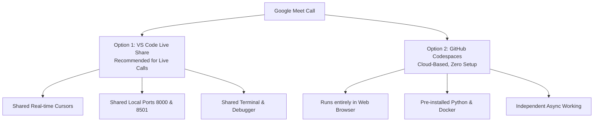

# Google Meet Collaborative Workspace Guide

This guide explains how you and Canishe can code together in real-time on Google Meet calls using **VS Code Live Share** and **GitHub Codespaces**.

---

## 🚀 The 2 Best Collaborative Workspace Options



---

## Option 1: VS Code Live Share (Best for Live Google Meet Pair Programming)

With **VS Code Live Share**, you can both be in the exact same editor simultaneously—seeing each other's cursor, editing code together, and sharing running servers.

### Step 1: Install Extension (Both of you do this once)
1. Open VS Code on your laptop.
2. Go to the **Extensions** tab (`Ctrl+Shift+X` or `Cmd+Shift+X`).
3. Search for **Live Share** (by Microsoft) and click **Install**.

### Step 2: Start the Session on Google Meet
1. Open the project folder (`personal/ai/canishe/OmniQuery-AI`) in VS Code.
2. In the bottom status bar or the left sidebar, click **"Live Share"** (or press `Cmd+Shift+P` -> `Live Share: Start Collaboration Session`).
3. It will copy a secure link to your clipboard (e.g. `https://vsls.code.visualstudio.com/...`).
4. Paste this link in the **Google Meet chat** to Canishe.

### Step 3: Canishe Joins in 1-Click
1. Canishe clicks the link.
2. It opens directly inside his VS Code (or in a Chrome browser tab if he doesn't have VS Code open).
3. **What You Can Do Together in Real-Time:**
   * **Co-Editing:** You both type and navigate files together.
   * **Port Sharing:** When you run the FastAPI backend (`port 8000`) or Streamlit UI (`port 8501`) on your Mac, VS Code automatically forwards the port so Canishe can test the UI in his browser directly!
   * **Shared Terminal:** You can grant Canishe access to run commands in your terminal.

---

## Option 2: GitHub Repository + Codespaces (Cloud Workspace)

If Canishe wants to code from any computer without setting up Python or Docker locally:

1. Push this project folder to a GitHub repository:
   ```bash
   cd /Users/jnarayanassamy/personal/ai/canishe/OmniQuery-AI
   git init
   git add .
   git commit -m "feat: initial OmniQuery-AI scaffold"
   git branch -M main
   git remote add origin https://github.com/<your-username>/OmniQuery-AI.git
   git push -u origin main
   ```
2. Add Canishe as a **Collaborator** on GitHub (*Settings > Collaborators > Add people*).
3. On GitHub, either of you can click **`Code` > `Codespaces` > `Create codespace on main`**.
4. GitHub will launch a full cloud VS Code environment in Chrome with everything pre-installed!
